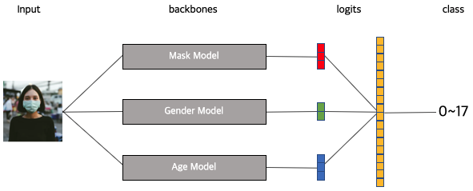

# pstage_01_image_classification - Multi Model

## Architecture
</img>

## Getting Started    
                                                             
### Install Requirements
- `pip install -r requirements.txt`

### Training
- `SM_CHANNEL_TRAIN=[train image dir] SM_MODEL_DIR=[model saving dir] python train.py`

### Inference
- `SM_CHANNEL_EVAL=[eval image dir] SM_CHANNEL_MODEL=[model saved dir] SM_OUTPUT_DATA_DIR=[inference output dir] python inference.py`

### Evaluation
- `SM_GROUND_TRUTH_DIR=[GT dir] SM_OUTPUT_DATA_DIR=[inference output dir] python evaluation.py`
